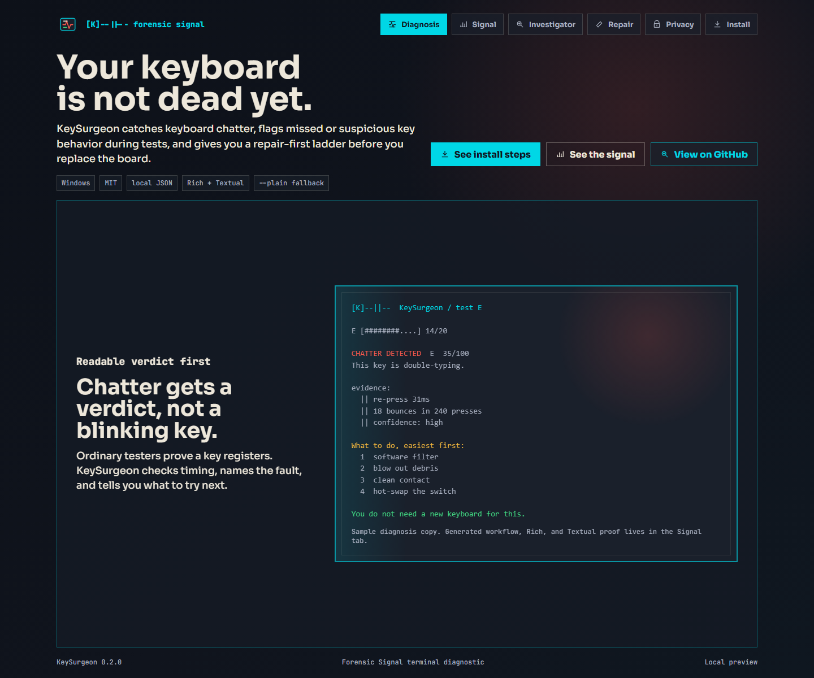
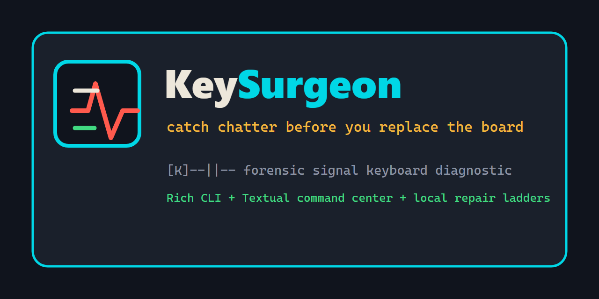
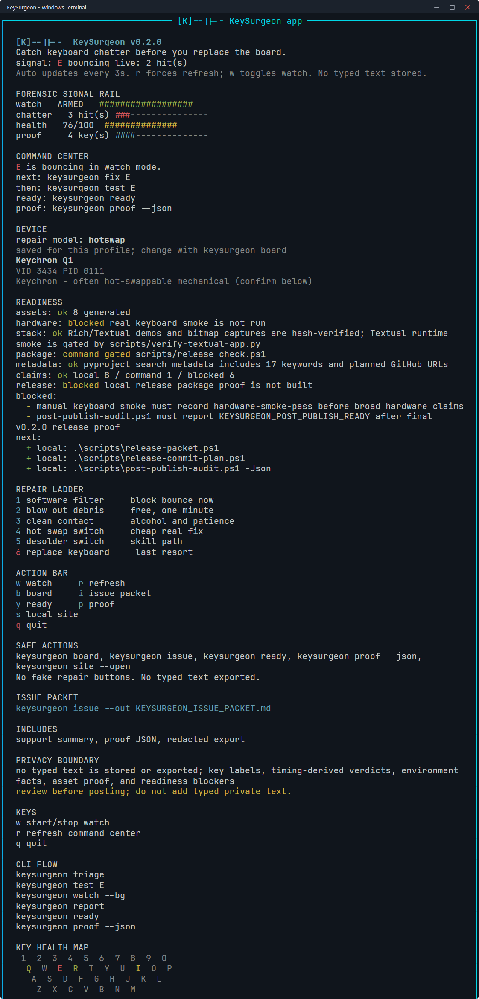

# KeySurgeon

[](site/index.html)

[](site/index.html)

Animated SVG demo of the local command loop: watch the signal, test a key,
follow the repair ladder, then prove what is ready without claiming hardware or
remote publish proof.

[](site/index.html)

[](site/index.html)

[](pyproject.toml)
[](#install)
[](LICENSE)
[](rich_ui.py)
[](app_textual.py)
[](#privacy)
[](#privacy)

**Catch keyboard chatter before you replace the board.**

## What You Get In 30 Seconds

- A terminal verdict for double-typing, dead, intermittent, sticky, or extra
  key behavior.
- Timing evidence that explains why a key is failing, not just whether it
  registers.
- A cheapest-first repair ladder: software filter, clean, switch swap,
  desolder, then replacement only when the evidence points there.
- A Rich default UI, optional Textual command center, and plain output for
  scripts or support logs.
- A redacted GitHub issue packet that keeps typed private text out of reports.

KeySurgeon is for the moment when a browser keyboard tester says a key works,
but the keyboard still double-types in real use.

## First Five Minutes

Run the local loop first:

```powershell
python -m pip install .
keysurgeon selftest
keysurgeon tour
keysurgeon test E
keysurgeon fix E
keysurgeon ready
keysurgeon proof --json
```

Read the first result as a repair decision, not a typing score. `HEALTHY` means
the tested key behaved normally. `WATCH` means the evidence is suspicious but
not enough to act on yet. `DEGRADING` means clean or isolate the switch.
`FAILING` means follow the repair ladder before replacing hardware.

If the fault only appears while you type normally, run `keysurgeon watch --bg`,
use the keyboard, then check `keysurgeon report`. For GitHub support, run
`keysurgeon issue`; it writes a redacted packet without typed private text.

[](docs/DIAGNOSIS_GUIDE.md)

[](app_textual.py)

The animated workflow strip is an SVG generated from seeded command frames, not
real hardware proof. The landing screenshot is captured from `site/index.html`
by headless Chrome or Edge. The terminal demo screenshots are browser-rasterized
PNG captures of KeySurgeon's Rich/Textual demo renderers with a Windows-style
terminal frame, so they read like the target platform without pretending to be
live interactive terminal sessions. The command center and workflow assets use
seeded sample state so the public proof stays stable. Regenerate them with
`.\scripts\generate-demo-assets.ps1`; the same command writes
`site/assets/keysurgeon-proof.json` with live hashes and source provenance.

KeySurgeon is a Windows terminal diagnostic for double-typing, dead keys,
intermittent keys, sticky behavior, and other fixable keyboard faults. It does
not stop at "your key works." It tells you what is failing and which repair to
try first.

```text
[K]--||--  KeySurgeon / test E

CHATTER DETECTED  E  35/100
evidence:
  || re-press 31ms
  || 18 bounces in 240 presses

next:
  1  software filter
  2  blow out debris
  3  clean contact
  4  hot-swap the switch
```

## Why Not A Keyboard Tester?

Most keyboard testers light up when a key registers. A chattering switch still
registers, it just registers twice. KeySurgeon looks at timing and repeated
events so it can catch the failure ordinary testers miss.

See `docs/KEYBOARD_TESTER_COMPARISON.md` for the focused comparison: where a
browser keyboard tester is enough, and where KeySurgeon's timing evidence,
watch mode, repair ladder, and redacted exports help.

## Install

Current local install, from this checkout:

```powershell
python -m pip install .
keysurgeon selftest
keysurgeon
```

Future public GitHub install, after the repository is created, pushed, and the
remote gates pass:

```powershell
python -m pip install "git+https://github.com/nosafune/keysurgeon.git"
keysurgeon selftest
```

Do not use the GitHub URL yet unless `keysurgeon proof --json` and
`.\scripts\pre-publish-audit.ps1` show the repository, remote workflow, Pages,
and release gates are no longer blocked.

KeySurgeon uses Rich for the default terminal UI and has a Textual command
center available with `keysurgeon app`. The app can start or stop the real
background watcher, show device identity, and route the next CLI command from
saved report or live watch state. Use `--plain` or `--no-color` for automation
and simple terminals.

## Why It Stands Out

- It catches chatter ordinary key-light testers miss.
- It gives a ranked repair ladder instead of jumping to replacement.
- `watch` can monitor normal typing for double-fires in the background.
- Rich/Textual views feel like a real terminal app, while `--plain` stays scriptable.
- `keysurgeon tour` gives new users the command loop, privacy posture, and proof gates without side effects.
- The app screen is state-driven: no fake metrics, no fake repair buttons.
- GitHub intake is split between bug reports, board model reports, and feature
  requests so useful public traffic turns into actionable diagnostics.
- `keysurgeon issue` writes a single redacted packet with support, proof, and
  export sections for GitHub bug reports.
- Starter issue templates give maintainers ready public issues for board data,
  install friction, repair wording, test coverage, and manual hardware smoke
  without overstating blocked proof.

## Contributing

Small, evidence-backed issues are the best fit for KeySurgeon right now. Start
with `CONTRIBUTING.md`, `docs/FIRST_ISSUES.md`, and
`docs/STARTER_ISSUE_TEMPLATES.md` before filing board data, repair metadata,
or diagnostic workflow changes.

## Current Publish Status

KeySurgeon is public-ready locally, not published. The local proof stack passes
`selftest`, landing render smoke, public-tree verification, package build, and
hash checks for the README/social/demo assets. The remaining publish blockers
are deliberate:

- real keyboard smoke must be recorded as `hardware-smoke-pass`;
- the v2 release files must be committed before any public push or tag;
- the GitHub repository and origin remote do not exist yet;
- remote selftest and Pages workflow runs do not exist yet;
- no GitHub release asset is published yet.

Run `.\scripts\launch-readiness.ps1` or
`.\scripts\launch-readiness.ps1 -AsMarkdown` for a one-page local launch board.
It summarizes proof and pre-publish audit state without touching git, GitHub, releases, Pages, or deploy state. Run `keysurgeon proof --json` or
`.\scripts\pre-publish-audit.ps1 -Json` for the current machine-readable state.
After publish, run `.\scripts\post-publish-audit.ps1 -Json` for read-only proof
of repository metadata, starter issues, workflow runs, Pages URL, and release
asset visibility.

## Proof Status

| Surface | Current local proof | Public status |
|---|---|---|
| Rich terminal UI | Demo SVG generated from `rich_ui.py`; PNG capture generated by `export-terminal-screenshots.ps1`; both checked by `verify-public-tree.ps1`. | Ready for README/social preview with Windows-style terminal framing. |
| Textual command center | `selftest` imports the app factory; `scripts/verify-textual-app.py` mounts the real app headlessly and presses core bindings; PNG capture is generated from the verified app demo. | Optional via `keysurgeon app`; shown with Windows-style terminal framing, not claimed as a live interactive session. |
| Public screenshots | Headless Chrome/Edge captures `site/index.html` as desktop and mobile PNGs. | Real local page screenshots, not generated terminal mockups. |
| Demo provenance | `keysurgeon-proof.json` records generator scripts, source modules, sizes, and SHA-256 hashes for screenshots, public demo, social, and workflow assets. | Verifier blocks stale demo proof. |
| Package metadata | `keysurgeon proof --json` and `verify-public-tree.ps1` check `pyproject.toml` keywords and project URLs. | Local package metadata matches the GitHub topic/search positioning. |
| Package build gate | `keysurgeon proof --json` points to `scripts/release-check.ps1` as the command-owned wheel/package proof. | Command-gated; no retained build artifact required. |
| Package/runtime | `local-release-proof.ps1` runs release check, wheel build, export, doctor, site render, executable package smoke, and post-publish visibility audit. | Local only until GitHub repo, workflows, Pages, and final release exist. |
| Privacy/export | `selftest` verifies redacted Markdown/JSON export and no private prose leakage. | No typed text is stored or exported. |
| Hardware behavior | Synthetic hook replay proves chatter timing logic. | Real keyboard smoke still required before broad hardware claims. |
| Git hygiene | `pre-publish-audit.ps1` checks `git status --porcelain -- .`. | Publish stays blocked while release files are uncommitted or untracked. |

## Quick Use

```powershell
keysurgeon                 # menu
keysurgeon app             # optional Textual command center
keysurgeon tour            # first-run command center and proof gates
keysurgeon triage          # guided "what is wrong?" flow
keysurgeon sweep           # walk the board and build a health report
keysurgeon watch           # watch normal typing for double-fires
keysurgeon watch --bg      # run hidden in the background
keysurgeon watch --status  # show background watcher status
keysurgeon watch --stop    # stop the background watcher
keysurgeon test E R T      # test specific keys
keysurgeon report          # show last results and trend
keysurgeon issue           # write a redacted GitHub issue packet
keysurgeon export          # redacted Markdown for issues or repair notes
keysurgeon export --json   # redacted JSON for structured bug reports
keysurgeon ready           # concise local launch readiness board
keysurgeon proof           # local proof/readiness report
keysurgeon site            # print the local landing/demo page path
keysurgeon site --open     # open the local landing/demo page
keysurgeon smoke           # write a manual hardware-smoke report scaffold
keysurgeon fix E           # repair ladder for one key
keysurgeon board           # set or confirm board type
keysurgeon doctor          # support/environment check
keysurgeon selftest        # logic checks, no keyboard needed
```

## What It Detects

| Fault | Meaning |
|---|---|
| chatter | one press registers twice |
| dead | key does not respond |
| intermittent | key skips some presses |
| sticky | hold or release behavior looks wrong |
| extra | late bounces after release |

## How To Read A Result

Start with the verdict, then the evidence. A low score is not a value judgment
on the keyboard; it is the current evidence for the tested key.

| Verdict | Meaning | What to do first |
|---|---|---|
| `HEALTHY` | tested behavior looked normal | stop |
| `WATCH` | suspicious but not proven | retest or run `keysurgeon watch` |
| `DEGRADING` | enough misses/repeats to act | clean or isolate the switch |
| `FAILING` | repeatable fault found | follow the repair ladder |

More detail: `docs/DIAGNOSIS_GUIDE.md`.

## The Repair Ladder

```text
software filter -> blow out debris -> clean contact -> hot-swap switch
   -> desolder and replace switch -> replace keyboard
```

Replacement is the last rung, not the default answer.

## Privacy

KeySurgeon observes key events and timing needed for diagnostics. It does not
store typed text and does not send telemetry.

For GitHub bug reports, run `keysurgeon issue`. It writes a single redacted
packet with support, proof, and export sections. For focused repair notes, run
`keysurgeon export`. It emits only tool version, platform, keyboard profile,
board type, detected device summary, key labels, verdicts, and scores. Use
`keysurgeon export --out report.md` to write a Markdown file or
`keysurgeon export --json` for structured output.

Local runtime files:

```text
%LOCALAPPDATA%\KeySurgeon\keysurgeon_profile.json
%LOCALAPPDATA%\KeySurgeon\keysurgeon_boards.json
%LOCALAPPDATA%\KeySurgeon\keysurgeon_watch.json
```

Set `KEYSURGEON_HOME` to use a portable or test directory.

## Development

```powershell
$files = Get-ChildItem -Filter *.py -File | ForEach-Object { $_.FullName }
python -m py_compile @files
python keysurgeon.py selftest
python keysurgeon.py --plain doctor
python keysurgeon.py issue --out .runtime\issue-packet.md
python keysurgeon.py export --json
python keysurgeon.py proof --json
python .\scripts\verify-textual-app.py
```

Release checks:

```powershell
.\scripts\verify-public-tree.ps1
.\scripts\release-check.ps1
```

Optional local executable build:

```powershell
.\scripts\build-exe.ps1
.\dist\keysurgeon.exe --version
```

Release docs:

- `docs/DIAGNOSIS_GUIDE.md`
- `docs/FIRST_ISSUES.md`
- `docs/STARTER_ISSUE_TEMPLATES.md`
- `docs/KEYBOARD_TESTER_COMPARISON.md`
- `docs/PROOF_MATRIX.md`
- `docs/ROADMAP.md`
- `docs/RELEASE_NOTES_0.2.0.md`
- `docs/RELEASE_CHECKLIST.md`
- `docs/PUBLISH_RUNBOOK.md`
- `docs/MANUAL_KEYBOARD_SMOKE.md`
- `docs/MANUAL_SMOKE_REPORT.md`
- `docs/GITHUB_METADATA.md`

Live hook behavior still needs a real keyboard smoke test before broad
promotion. Run `keysurgeon smoke` to write a safe report scaffold from a
checkout, pip install, or executable artifact, then run
`keysurgeon smoke --check docs\MANUAL_SMOKE_REPORT.md` before recording
`hardware-smoke-pass`. A PyInstaller `.exe` build script and GitHub artifact workflow are
included, but no installer, Winget package, PyPI release, or GitHub release
asset has been published yet.

## License

MIT.
