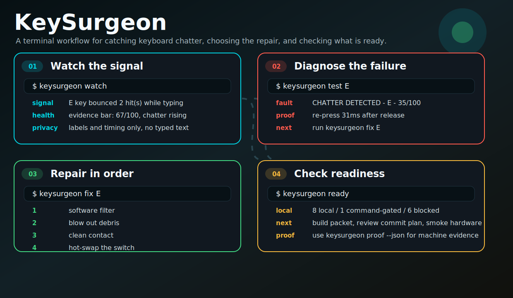
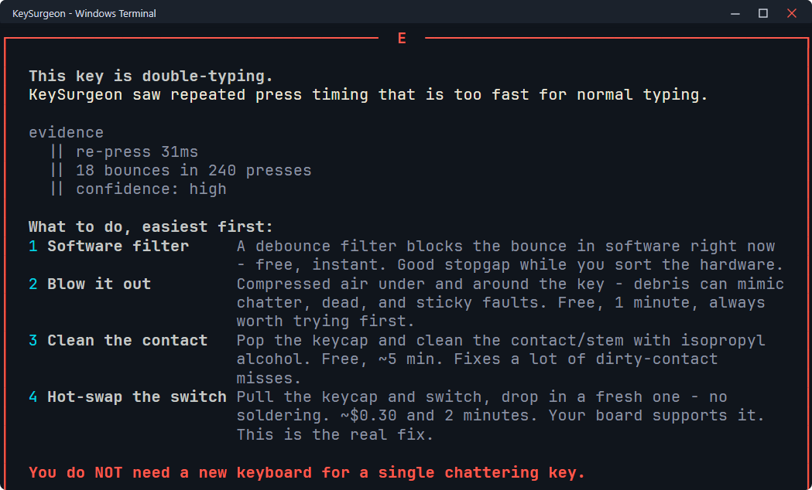

# KeySurgeon

[](site/index.html)

[](site/index.html)

[](pyproject.toml)
[](#install)
[](LICENSE)

KeySurgeon is a Windows terminal tool for diagnosing keyboard faults: chatter
(double-typing), dead keys, intermittent keys, and sticky keys. It watches key
events and press timing, not just whether a key registers, and it recommends
the cheapest fix first instead of jumping straight to "buy a new keyboard."

## Why not a browser keyboard tester?

Most keyboard testers answer one question: did the key register? A chattering
switch registers fine — it just registers twice. KeySurgeon looks at timing
between events, which is what actually catches chatter. See
`docs/KEYBOARD_TESTER_COMPARISON.md` for the longer comparison.

## Install

From the public repo:

```powershell
python -m pip install "git+https://github.com/nosafune/keysurgeon.git"
keysurgeon selftest
```

From a local checkout:

```powershell
python -m pip install .
keysurgeon selftest
```

A Windows `.exe` build is also available from the
[GitHub releases page](https://github.com/nosafune/keysurgeon/releases), if
you'd rather not install Python.

Requires Windows and Python 3.10+.

```text
[K]--||--  KeySurgeon / test E

CHATTER DETECTED  E  35/100
evidence:
  || re-press 31ms
  || 18 bounces in 240 presses

next:
  1  software filter
  2  blow out debris
  3  clean contact
  4  hot-swap the switch
```

[](docs/DIAGNOSIS_GUIDE.md)

## Quick use

```powershell
keysurgeon                 # menu
keysurgeon app              # optional Textual command center
keysurgeon tour             # walkthrough of the command loop
keysurgeon triage           # guided "what is wrong?" flow
keysurgeon sweep            # walk the board and build a health report
keysurgeon watch            # watch normal typing for double-fires
keysurgeon watch --bg       # run hidden in the background
keysurgeon watch --status   # show background watcher status
keysurgeon watch --stop     # stop the background watcher
keysurgeon test E R T       # test specific keys
keysurgeon report           # show last results and trend
keysurgeon issue            # write a redacted GitHub issue packet
keysurgeon export           # redacted Markdown for issues or repair notes
keysurgeon export --json    # redacted JSON for structured bug reports
keysurgeon proof            # local proof report
keysurgeon proof --json
keysurgeon site              # print the local landing/demo page path
keysurgeon site --open
keysurgeon smoke             # write a manual hardware-smoke report scaffold
keysurgeon fix E             # repair ladder for one key
keysurgeon board             # set or confirm board type
keysurgeon doctor            # support/environment check
keysurgeon selftest          # logic checks, no keyboard needed
```

Read the result as a repair decision, not a grade. `HEALTHY` means the tested
key looked normal. `WATCH` means the evidence is suspicious but not enough to
act on. `DEGRADING` means clean or isolate the switch. `FAILING` means work
through the repair ladder before you replace anything. Details in
`docs/DIAGNOSIS_GUIDE.md`.

## How it works

KeySurgeon installs a low-level Windows keyboard hook (`WH_KEYBOARD_LL`) and
timestamps each event with `perf_counter`. It looks at the gap between a
key's press/release events and any re-presses that follow, scores the pattern
against known fault signatures, and reports a 0-100 confidence score per key.
From there it walks a repair ladder that starts cheap — software filter,
compressed air, contact cleaning, switch swap — and only ends at "replace the
keyboard" if nothing else explains the evidence.

## Privacy

KeySurgeon does not store or export typed text. It only keeps key labels,
timing, and derived verdicts. `keysurgeon issue` writes a redacted packet for
GitHub bug reports — no private text in it.

The animated workflow demo and terminal screenshots above are rendered
straight from KeySurgeon's real UI code (Rich/Textual renderers) using seeded
sample data, not screen-recorded live sessions — that keeps the public demo
stable and reproducible. Real-hardware validation status is tracked in
`docs/MANUAL_SMOKE_RESULT.md`.

## Contributing

See `CONTRIBUTING.md` and `docs/FIRST_ISSUES.md` for good starting points.

## License

MIT.
